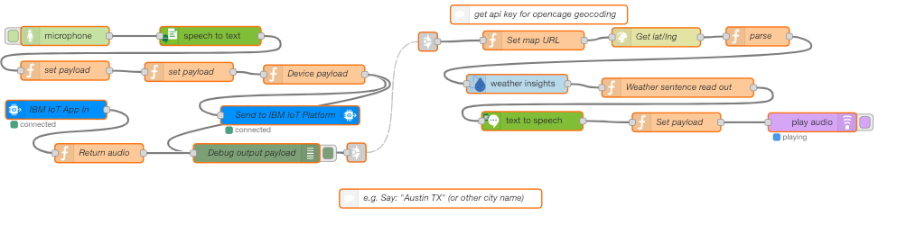

# microphone-nodered-iot-weather-speaker

Included Technologies:

* 1 - IBM Cloud Node-RED Starter
* 2 - Speech-To-Text service from IBM Cloud Catalog
* 3 - Internet of Things service from IBM Cloud Catalog
* 4 - Weather Insights service from IBM Cloud Catalog
* 5 - Text-To-Speech service from IBM Cloud Catalog
* 6 - Sign up to OpenCage Geocoder https://opencagedata.com/api for free API key that will be used to get latitude and longitude.

> Make sure to have your device's microphone and speaker active for this project

## Useful links

* [IBM Cloud](https://bluemix.net/)  
* [Hovig's Github](https://github.com/hovig?tab=repositories)

## License
This code pattern is licensed under the Apache Software License, Version 2.  Separate third party code objects invoked within this code pattern are licensed by their respective providers pursuant to their own separate licenses. Contributions are subject to the [Developer Certificate of Origin, Version 1.1 (DCO)](https://developercertificate.org/) and the [Apache Software License, Version 2](http://www.apache.org/licenses/LICENSE-2.0.txt).

[Apache Software License (ASL) FAQ](http://www.apache.org/foundation/license-faq.html#WhatDoesItMEAN)
